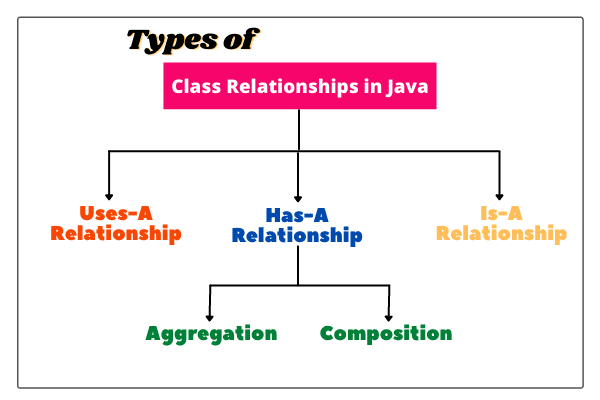
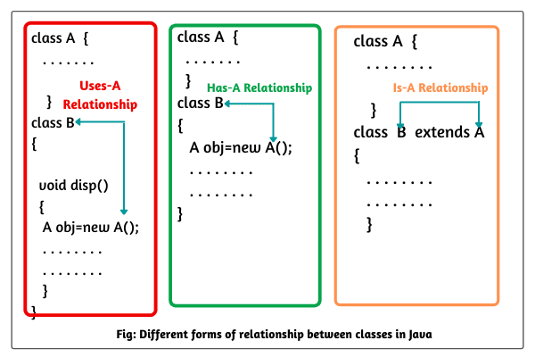
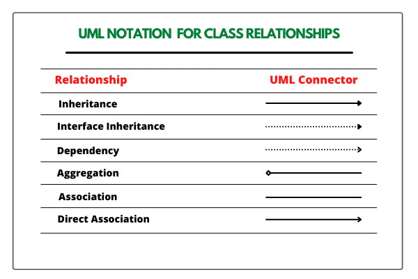

# Pre-requisites
* Java 1.8/1.11/1.15
* Gradle 6

# How to run the code

We have provided scripts to execute the code. 

Use `run.sh` if you are Linux/Unix/macOS Operating systems and `run.bat` if you are on Windows.

Internally both the scripts run the following commands 

 * `gradle clean build -x test --no-daemon` - This will create a jar file `geektrust.jar` in the `build/libs` folder.
 * `java -jar build/libs/geektrust.jar sample_input/input1.txt` - This will execute the jar file passing in the sample input file as the command line argument

 Use the build.gradle file provided along with this project. Please change the main class entry under the `jar` task

 ```
 manifest {
        attributes 'Main-Class' : 'com.geektrust.backend.App' //Change this to the main class of your program which will be executed
    }
```
in the build.gradle if your main class has changed.

 # How to execute the unit tests

 `gradle clean test --no-daemon` will execute the unit test cases.

# Help

You can refer our help documents [here](https://help.geektrust.in)
You can read build instructions [here](https://github.com/geektrust/coding-problem-artefacts/tree/master/Java)

# Use Case Diagram
* Identify the actors
* Identify the what the different actors can do
* Focus on `what to do` and not `how to do`

### Benefits of Use Case Diagram
* This can directly shift into your `interfaces`.

# Identify the core Entities
* Nouns in requirements are possible candidates for Entities.
* Verbs in the requirements are possible methods.
* Ignore some of the nouns if we feel they won’t hold any vital information related to the problem description.
* You might possibly store the identified entities in Database
* Skip the nouns if they could be an attribute for any entity.
  - “City” could be an entity but in some cases it is more likely to be an attribute. Like attribute to a Address Entity.
# Class Relationships
   
   
   
  - ## Uses a Relationship
    It means one single object is using the other object i.e. using the services of the other object.  
      eg: Service layers uses entities for sometime and then destroy them. It doesn't own the entities.
  - ## Has a Relationship
    It means that among two entities, one entity is owning the other entity.
       
    `Lifecycle Dependency` : When we destroy a entity then other entity also gets destroyed.
    - whenever deciding for lifecycle dependency, think from the parent perspective. eg: managers has workers who work under him is aggregation whereas composition is Manager has the responsibility of ensuring that the project is successful.(assuming on removing the manager the project will also go away otherwise it will also become aggregation)
    
    1. ### Association
       It is more in line with `uses a relationship` as there is `no sense of ownership`.  

       We call Association those relationships whose objects have an `independent lifecycle` and where there is `no ownership between the objects`.

       - From Code Perspective think of it as if a single object can be passed to multiple classes. Eg : Teacher and Students(Multiple students can have a single teacher and single student can have multiple teachers.), Manager and Swipe Card (In this requirement the manager object and swipe card object use each other but they have their own object life time. In other words they can exist without each other)
       `The most important point in this relationship is that there is no single owner.`  
         
       
       
    3. ### Aggregation
       There is `sense of ownership` but `no lifecycle dependency`.

       We call Aggregation those relationships whose `objects have an independent life cycle`, but `there is ownership`, and `child objects cannot belong to another parent object`.
         
    2. ### Composition
       There is `sense of ownership` and also `lifecycle dependency`.

       We use the term Composition to refer to relationships whose `objects don’t have an independent lifecycle`, and `if the parent object is deleted, all child objects will also be deleted`.
       In this relationship both objects are heavily dependent on each other. In other words if goes for garbage collection the other also has to garbage collected , or putting from a different perspective the life time of the objects are same.  

        - Generally the parent object will be passed as a argument inside the constructor of the child object. eg : Hotel has Rooms. If Hotel is destroyed, rooms too (Everytime while creating the object of Room, the same hotel object will be passed inside the constructor of each room)
  - ## Is a Relationship
    Generally used to identify inheritance.


